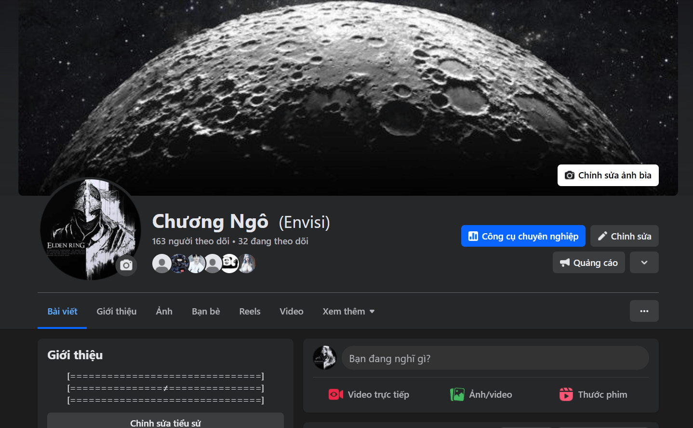

<h2 align="center">🚀 🛠 Technologies and Tools 🛠 🚀</h2>
 

  <!-- Frontend Skills -->
  <h3>🎨 Frontend</h3>
  
  
  
  
  
    
  
  <!-- Backend Skills -->
  <h3>🖥 Backend</h3>
  
  
  
  
    

  <!-- Tools -->
  <h3>🔧 Tools</h3>
  
  
  
  
  

 
<h2 align="center">🔥 GitHub Stats & Achievements 🔥</h2>
<!-- Enhanced GitHub Stats Section -->
 

  
  
  
  
  

 

 
<h2 align="center">👽 Where to find me 👽</h2>
 
<!-- https://icons8.com -->

  
  
  
  
  

 
<h2 align="center">📖 About Me: IT Student at Dalat University 📖</h2>
 

  <strong>👨‍💻 Hi, I’m a 2nd-year IT student at Dalat University. I'm passionate about learning new technologies, especially in the fields of AI, Unreal Engine, and Blender, with a keen interest in game development.</strong>

  <strong>☕ Currently, I'm focusing on building my skills in AI and game development, including learning how to use Unreal Engine and Blender to create immersive experiences. I plan to continue expanding my knowledge in these areas as I progress in my studies.</strong>

  <strong>🔗 Feel free to connect with me on Facebook: <a href="https://www.facebook.com/profile.php?id=100046108932088&mibextid=ZbWKwL" target="_blank">My Facebook</a></strong>
   
  <strong>📧 Or Email me: <a href="mailto:chuongngo171005@gmail.com" target="_top">chuongngo171005@gmail.com</a></strong>

 
<h2 align="center">📑 My Passion for Game Development 📑</h2>
 

